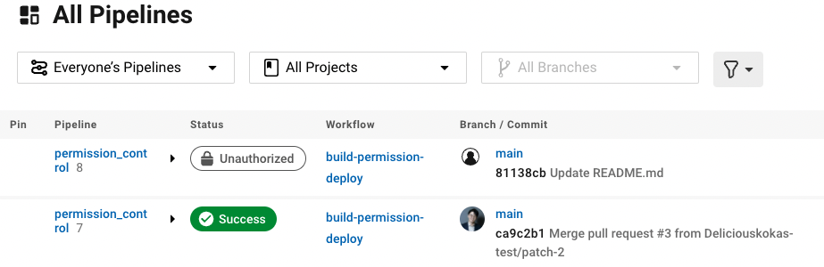
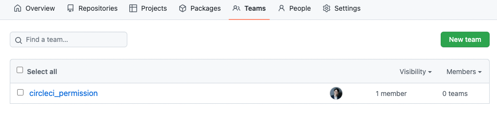
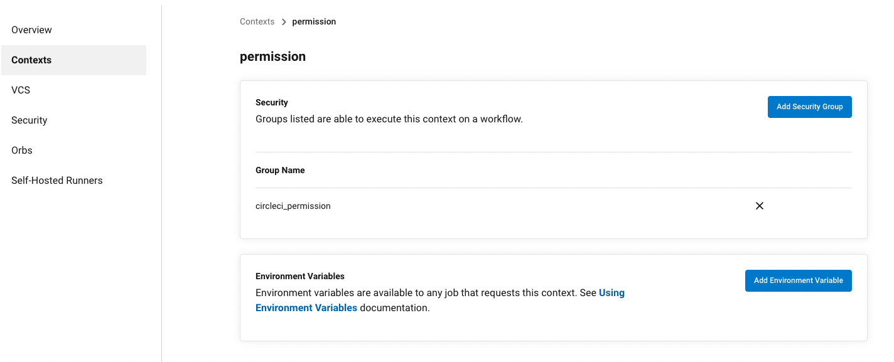

# How to restrict particular pipeline in CircleCI by user
This repository shows `How to restrict particular pipeline in CircleCI by user`.  
I suggest restricting pipelines to combine `CircleCI Organization Settings Contexts` and `Github Teams`.  
You can easily control your permission to run the pipeline by setting up `Github Teams` as a security group to Contexts.

# Setup
1. Create `Github Teams` and add members that you want to allow the pipeline.

2. Create `Contexts` and add a security group that you just created.  
  The default security group is for `All members`, you should delete it to restrict the pipeline.

3. [Set workflows](./.circleci/config.yml) to use `Contexts`
